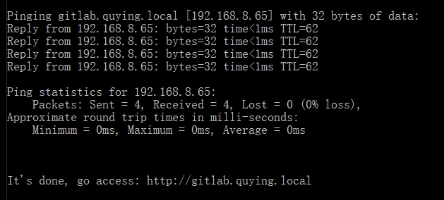

# 一键更新局域网 DNS

## 64位 Windows7（含）以上的操作系统

1. **右键，另存为**：[update-lan-dns.bat](http://192.168.130.242:10080/wangg/hosts-edit/raw/feature/quying-dns/asset/update-lan-dns.bat)
1. 打开**所在目录**，找到在下载得到的文件
1. 在该文件上：**右键 -> 以管理员身份运行(A)**（如果期间出现 **NodeJS** 的安装，请同意，任何对权限的提示，一律允许。）
1. 重复步骤 **3**，看到下图的提示内容，表示安装成功，请访问： http://gitlab.quying.local



## Linux、MacOSX 等操作系统

1. 请自行到 https://nodejs.org/en/download/current/ 安装系统适用的 NodeJS 版本，安装好后输入以下命令确认安装成功：

    ```shell
    npm -v
    3.10.10
    ```

1. 安装 `hosts-edit` ：

    ```shell
    cd

    mkdir temp

    cd temp

    git clone https://github.com/windsting/hosts-editor.git

    cd hosts-editor

    sudo npm install -g
    ```

1. 更新 hosts 条目：

    ```shell
    sudo hosts-edit 192.168.130.242 gitlab.quying.local
    ```

1. 如果以上步骤都没有报错，请访问： http://gitlab.quying.local
